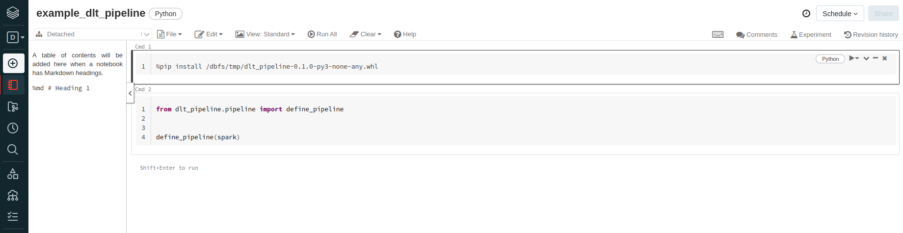
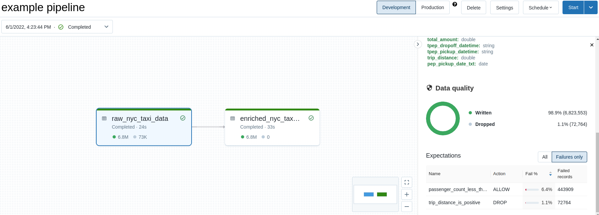

# DLT_Template
A template repository for Delta Live Tables projects

This repository makes use of a dataset of New York taxi data, and shows how to process it to add
a new computed column and some data quality checks. This repository contains
the code of all the transformations and quality checks used in the pipeline.
It is packaged in a python wheel that you can deploy on Databricks and use
with a DLT Notebook looking like the screenshot below.

After deploying the lib and creating the above notebook, you can create a DLT
pipeline using the notebook. You can leave all the settings with their default
value, just specify the notebook. You can then run the DLT pipeline and get
a successful run like in the screenshot below!

This repository is intended to be a starting point for implementing a more useful DLT pipeline
without having to reinvent the wheel and without working with a dangerously complex Databricks Notebook.
See the available features below ⬇️

## Features

* you can package the code in a python wheel and deploy it on DBFS in one command:
  `make deploy_dlt_pipeline dbfs_destination=/tmp/dlt_pipeline-0.1.0-py3-none-any.whl`.
  you can change the destination for wherever you like.
* you have the following tools already setup:
  * pytest, with an example test including a spark fixture
  * pylint
  * black
  * isort
  * mypy
* you have make targets for all of the above, and an `all_checks` target that
  runs everything at once.
* you have pre-commit hooks for all of these tools.

## What could be improved

* adding a CI/CD pipeline to run all the checks and deploy automatically if everything passes.

## Contributing

* don't hesitate to post an issue or a PR if you want to contribute :)
